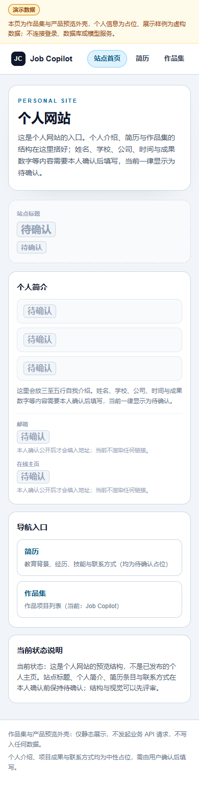

# Portfolio Site · 个人网站与作品集

> **持续开发中｜展示页面与静态导出已实现｜尚未正式上线**
>
> 本仓库用于建设个人主页、项目作品集和公开简历展示。后续继续完善个人内容、视觉及交互，再部署网站 MVP。

**状态更新：2026-10-04。** 当前个人资料包含待确认占位，不能作为完整个人简历引用。

## 项目介绍

面向招聘者与潜在协作者的个人展示网站，将个人介绍、公开简历、项目案例与代码入口集中在一个易浏览的页面体系中。目标是让访问者从“我关注什么 → 我做过什么 → 我承担什么 → 有哪些可检查的成果”了解项目所有者。

网站规划包含个人首页、关于与公开简历、作品集列表、项目案例详情、GitHub 外链和用户确认后的联系方式。案例页说明需求背景、关键决策、实际分工、技术栈、展示图片、已完成内容与待完善事项；支持桌面和手机基本访问。首个项目案例为 [Job Copilot](https://github.com/jiuyier369-design/job-copilot)：通过说明、架构、截图和代码链接展示。

网站与 Job Copilot 使用独立仓库及工作目录。**网站不连接 Job Copilot 的登录、分析、数据库或收费模型接口。** Job Copilot 持续完善中；网站支线独立推进，当前仅通过公开项目链接关联。

## 页面与当前进度

| 页面 / 模块 | 当前状态 |
| --- | --- |
| 个人首页 | 页面已实现，个人信息待确认 |
| 作品集列表与 Job Copilot 案例 | 已实现展示页及 GitHub 外链 |
| 公开简历页 | 页面骨架已有，内容需用户核对 |
| 虚构 UI 预览 | 已实现，仅展示页面交互 |
| 桌面 / 手机适配 | 已完成基础检查，后续页面修改仍需复核 |
| 静态构建 | 已通过，导出到 out/ |
| 托管、正式域名与线上验收 | 尚未完成 |

## 网站概念封面


封面由 AI 生成，用于展示“个人网站”的主题和桌面／手机布局方向，**不是已实现页面截图**。图中的人物、职业标签和卡片均为概念占位，不代表项目所有者的真实身份、经历或最终网站内容。原求职项目截图不再作为网站主图。

<details>
<summary>查看手机首页截图</summary>



</details>

## 技术栈与项目边界

**Next.js 16 · React 19 · TypeScript 5.9 · Tailwind CSS 4 · CSS Modules · 静态导出**

本仓库不包含 API 路由、数据库、模型适配或 Supabase 客户端依赖。展示类型为独立本地拷贝；当前不做跨仓库自动同步。

## 本地查看与构建

使用 Node.js 24（已验证 24.21.x）：

```bash
npm ci
npm run dev
npm run typecheck
npm run build
```

启动后打开 http://localhost:3000 ，可访问：

- /：个人首页。
- /portfolio：作品集。
- /portfolio/job-copilot：项目案例。
- /resume：公开简历展示。
- /ui-preview/**：虚构数据交互展示，不是实际求职服务。

构建使用静态导出，输出 out/。当前类型检查及构建通过；桌面、390px 手机展示检查无水平溢出。后续代理选择托管方案并完成线上验收。

## 后续开发计划

1. 用户确认公开姓名、经历、求职方向与联系方式。
2. 完善首页及简历内容，统一视觉、导航和移动端体验。
3. 检查所有项目链接、键盘操作与展示措辞。
4. 部署静态网站，验收线上访问后补充网站地址和上线状态。

继续开发先读 [AGENT_HANDOFF.md](AGENT_HANDOFF.md)。代理只修改本仓库，不读取私有求职资料，不修改 Job Copilot，不编造占位信息。

## 本人与 Agent 的分工

本人负责展示目标、内容结构、项目事实核对、公开个人信息和最终页面验收。WorkBuddy 参与展示层页面、组件与响应式实现；Codex 负责原展示层审查、独立分仓、静态构建配置与发布整理。后续网站实现由用户选定的 Agent 平台继续推进，实际贡献按提交与交接记录描述。

## 来源与贡献

展示层来源提交 c42c59bfb33b34795b2938f5dc2b4cbee0534566，包含 WorkBuddy 实现与 Codex 审查。独立抽取、项目骨架与发布整理由 Codex 完成；详见 [AUTHORS.md](AUTHORS.md)。

原开发目录和历史完整保留。本仓库独立维护，个人网站完成后会继续更新本说明。

暂未授予开源许可证。
